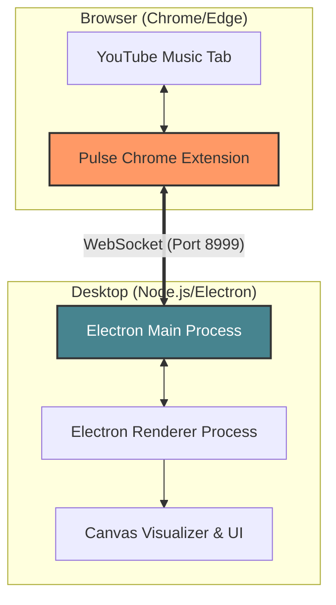

# 🎵 Pulse — Lightweight YouTube Music Controller

[](https://opensource.org/licenses/ISC)
[](https://www.electronjs.org/)
[](https://github.com/Fahadada-code/Pulse)

**Pulse** is a sleek, persistent desktop overlay widget designed to give you instant control over your **YouTube Music** playback. It lives on your desktop, staying above other windows without stealing focus, allowing you to jam out while you work, game, or browse.

---

## ✨ Features

- **🚀 Persistent Overlay**: Stays always-on-top, even over fullscreen games or applications.
- **🎨 Dynamic Visualizer**: Real-time audio frequency bars and pulsing borders that react to your music.
- **🖼️ Smart Mini-Mode**: Switch between a detailed view (album art, controls, title) and a compact, circular floating bubble.
- **🌓 Theme Integration**: The widget's glow and visualizer colors dynamically adapt to the currently playing track's album art.
- **🎹 System-Level Shortcuts**: Global hotkeys (Ctrl+Shift+Q by default) to quickly exit the app.
- **🔇 Advanced Controls**: Seek forward/backward, adjust volume, and toggle mute directly from the widget.
- **🔗 Hybrid Architecture**: Uses a Chrome Extension to bridge the gap between the web player and your desktop.

---

## 🏗️ Architecture

Pulse uses a high-performance bridge architecture to ensure low-latency communication between your browser and the desktop widget.



---

## 🛠️ Setup & Installation

### 1. Prerequisites
- **Node.js** (v18 or higher recommended)
- **Google Chrome** or a Chromium-based browser (for the extension)

### 2. Desktop App Setup
```bash
# Clone the repository
git clone https://github.com/Fahadada-code/Pulse.git
cd Pulse

# Install dependencies
npm install

# Start in development mode
npm start

# Build standalone installer
npm run dist
```

### 3. Chrome Extension Setup
1. Open Chrome and navigate to `chrome://extensions/`.
2. Enable **Developer mode** (top right).
3. Click **Load unpacked** and select the `extension` folder from this repository.
4. Open [YouTube Music](https://music.youtube.com) and start playing a track!

---

## 🎮 Usage Guide

| Action | Control |
| :--- | :--- |
| **Play/Pause** | Click the Play/Pause button |
| **Next/Prev** | Standard media navigation buttons |
| **Seek** | Use `-10s` / `+10s` buttons |
| **Volume** | Drag the volume slider |
| **Mini-Mode** | Click the minimize icon to shrink into a floating bubble |
| **Expand** | Click the mini-bubble to return to the full widget |
| **Exit** | Click the `✕` button or use `Ctrl + Shift + Q` |

---

## 🔧 Troubleshooting

- **"Disconnected" message**: Ensure the YouTube Music tab is open and the Pulse extension is active. Refreshing the YouTube Music page often fixes connection issues.
- **Visualizer not moving**: Click anywhere on the widget once to resume the Web Audio Context (browser security requirement).
- **Extension Outdated**: If you see this warning, go to `chrome://extensions/` and click the **Reload** icon on the Pulse extension.

---

## 📄 License
This project is licensed under the **ISC License**. See the `LICENSE` file for details (if provided, otherwise defaults to ISC in `package.json`).

---

<p align="center">
  Generated with ❤️ by Pulse Team
</p>
